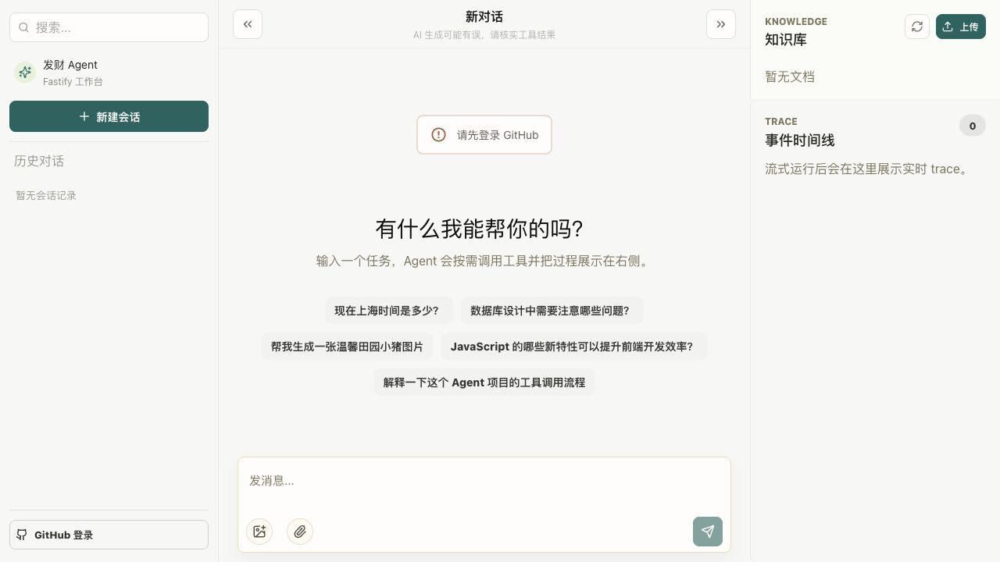
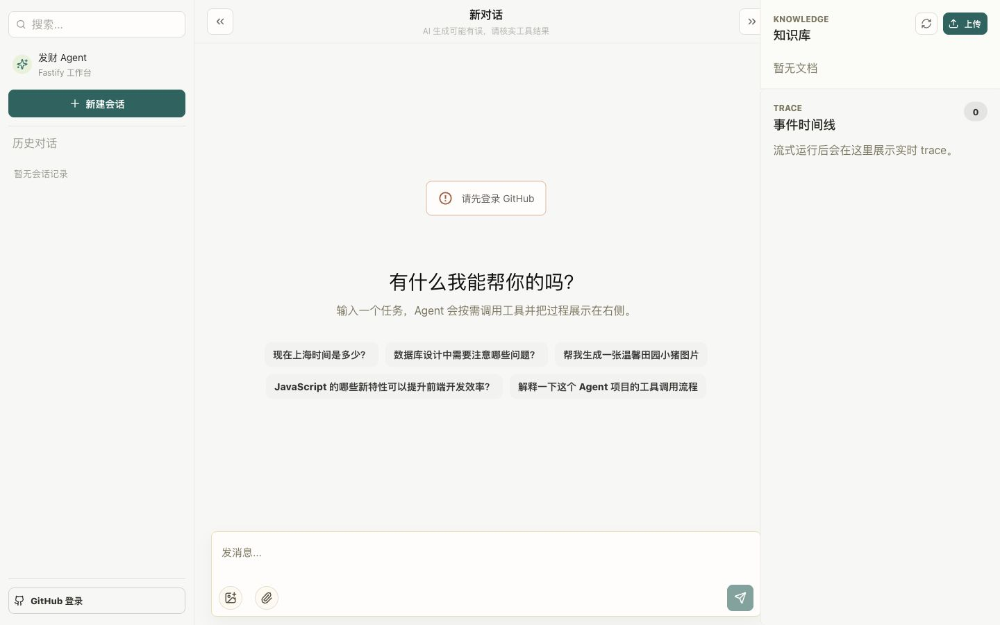

# 发财 Agent 界面改版建议

日期：2026-07-10  
范围：`apps/web` 桌面端与移动端工作台  
建议方向：克制型 AI 工作台（克制、清晰、以对话任务为中心）

## 实现状态

P0 改版已于 2026-07-10 落地：

- 已统一中性画布、白色表面与青绿色品牌设计令牌；
- 已将右侧常驻栏改为默认关闭的事件 / 知识库检查器；
- 已完成 1024px 以下单列主区、覆盖式会话导航和全屏移动检查器；
- 已重做顶栏、空状态任务卡、消息节奏、用户气泡和输入区；
- 已合并附件上传入口，补充快捷键提示、焦点态、触控尺寸和减少动态效果的适配；
- 已完成 1440、1024、390 三档浏览器验收，并通过 Web 全量测试与生产构建。

## 结论先行

当前界面的主要问题不是“装饰不够”，而是以下四件事叠加在一起：

1. 对话、知识库、开发追踪三种不同频率的任务被永久并排，主任务没有绝对视觉优先级。
2. 奶黄、浅绿和中性灰三套视觉语言同时存在，颜色显旧、显脏，组件也缺少统一层级。
3. 空状态、消息、输入框和侧栏都延续了演示版或管理后台的表达方式，没有形成现代 AI 产品的专注感。
4. 移动端只是把三栏纵向堆叠，首屏先展示完整会话栏，聊天输入区无法立即触达。

因此，这次改版应先改信息架构和设计系统，再做组件精修。只换颜色、加阴影或做玻璃拟态，效果不会持久。

## 现场截图与问题判断

### 1280 × 720 桌面端



截图中最明显的问题：

- 左栏固定 280px、右栏固定至少 320px，1280px 屏幕有 600px（约 47%）被两个侧栏占用；中间聊天区只剩 680px。
- 右侧在“暂无文档、0 条事件”时仍永久占据 25% 屏幕，空信息的视觉权重反而高于主任务。
- 中央空状态、五个长句标签、登录提醒和大输入框彼此分散，留白很多但没有明确焦点，属于“空”而不是“简洁”。
- 左右栏、大量 1px 边框、8px 圆角和弱灰文字组合在一起，更像传统后台工作台。
- `Knowledge / Trace / Fastify 工作台 / Agent` 中英与技术词混用，产品仍带明显的开发演示版气质。

### 1440 × 900 宽屏



宽屏下虽然不拥挤，但问题更明显：中间存在大块无功能留白，右侧调试面板仍常驻；视觉层级没有随着空间增加而改善。

### 390 × 844 手机首屏


移动端当前把侧栏、聊天区和右栏依次纵向排列：

- 会话栏先占约 338px 高度，用户打开页面后不能立刻进入主要任务。
- 聊天顶栏、登录提示和空状态继续向下堆叠，首屏看不到输入框。
- 完整页面高度约 1360px；知识库和追踪信息还会继续出现在聊天之后。
- 这不是移动端导航，而是桌面三栏的线性展开。

另外，在 1024px 宽度下实测：左栏 280px、右栏 320px，中间聊天区仅 424px。现有响应式要到 900px 以下才切换，901–1024px 是最难用的区间。

## 为什么现在看起来“不现代”

### 1. 产品主次关系错误

用户进入产品的核心目标是完成任务或继续对话，而不是持续观察知识库和底层事件。当前三栏等权，使界面首先像运维控制台，其次才像 AI 助手。

建议的新优先级：

1. 对话与任务完成
2. 当前任务过程、引用资源
3. 知识库管理
4. 原始运行日志和 JSON 数据

后两项不应常驻主画布。

### 2. 设计令牌没有成为唯一来源

`mui-theme.ts` 定义了奶黄背景和米黄纸面，`styles.css` 又把工作区覆盖成灰白，并穿插浅绿色按钮与卡片。静态扫描显示：

- `styles.css` 已有 3067 行；
- `styles.css` 与 `mui-theme.ts` 合计出现 115 个不同的十六进制色值；
- `styles.css` 中有 88 次 `.Mui...` 类选择器引用。

结果是主题系统、业务 CSS 和高优先级覆盖同时控制外观，任何局部改动都容易露出另一套颜色或圆角。

### 3. 信息密度和留白都没有形成节奏

- 消息列表间距固定为 65px，系统消息还有 42px 上下外边距，聊天会显得松散而不精致。
- 消息操作绝对定位在内容下方，默认透明；桌面难发现，触屏更不可发现。
- 右栏每条事件都提供“原始事件”折叠面板，运行时信息噪声会快速上升。
- 空状态使用五个长句标签，没有任务类别、图标和推荐层级。
- 输入区占据较大高度，但上传图片、上传文档、发送三个动作彼此分散，缺少统一操作模型。

### 4. 可访问性会直接影响“精致感”

- 全局移除了 `focus-visible` 外轮廓，却没有统一的替代焦点环。
- 多个消息操作按钮只有 24px，会话删除按钮约 28px，低于舒适触控尺寸。
- 多处 12px 浅灰文字对比度不足，尤其是顶栏免责声明、历史标题和消息时间。
- 删除会话和知识库文档缺少确认或撤销反馈。

## 推荐的新信息架构

### 桌面端

```text
┌──────────── 248px ────────────┬──────────────── 主工作区 ────────────────┐
│ 品牌 / 新建                    │ 真实会话标题          运行详情 / 更多       │
│ 搜索                           ├───────────────────────────────────────────┤
│ 今天                           │                                           │
│   会话 A                       │              对话内容                     │
│   会话 B                       │          最大阅读宽度 720–760px            │
│ 昨天                           │                                           │
│   会话 C                       │                                           │
│                                │        浮动、吸底的输入区                 │
│ 用户菜单                       │                                           │
└────────────────────────────────┴───────────────────────────────────────────┘
                                             ┌──── 360–400px 检查器 ───────┐
                                             │ 事件 | 知识库                 │
                                             │ 默认关闭，按需覆盖或固定       │
                                             └───────────────────────────────┘
```

布局规则：

- `>= 1440px`：会话栏可常驻；检查器默认关闭，用户主动固定后才占宽。
- `1024–1439px`：会话栏可折叠；检查器必须使用覆盖式抽屉，不压缩聊天区。
- `< 1024px`：聊天区单列占满；会话与检查器分别使用抽屉或底部面板。
- 对话正文最大宽度 760px，超宽屏增加两侧留白，不无限拉长文本行。

### 移动端

```text
┌──────────────────────────────┐
│ ☰  会话标题          运行详情 │
├──────────────────────────────┤
│                              │
│          对话内容             │
│                              │
├──────────────────────────────┤
│  +  输入任务……           ↑   │
└──────────────────────────────┘

☰ → 会话抽屉
运行详情 → 底部面板：事件 / 知识库
```

移动端不再渲染“侧栏 → 聊天 → 追踪信息”的长页面；输入区始终在安全区上方可触达。

## 视觉方向与设计令牌

整体采用中性画布和白色表面，保留青绿色作为品牌识别，不做大面积奶黄，也不做强玻璃拟态。

### 颜色

| 语义 | 建议色值 | 用途 |
| --- | --- | --- |
| 画布 | `#F7F8FA` | 页面底色 |
| 表面 | `#FFFFFF` | 侧栏、输入区、抽屉 |
| 次级表面 | `#F9FAFB` | 悬停、分组背景 |
| 主要文本 | `#101828` | 标题、正文 |
| 次要文本 | `#667085` | 辅助说明 |
| 三级文本 | `#98A2B3` | 时间等低优先信息，需确保字号和对比度 |
| 边框 | `#EAECF0` | 普通分隔 |
| 品牌色 | `#0F766E` | 主操作、选中态 |
| 品牌悬停色 | `#115E59` | 悬停、按下状态 |
| 品牌浅色 | `#F0FDFA` | 用户消息、弱选中态 |
| 成功色 | `#16A34A` | 完成状态 |
| 警告色 | `#D97706` | 警告状态，不做大面积背景 |
| 危险色 | `#DC2626` | 错误与危险动作 |

规则：同一屏只允许一个主要强调色；黄、绿、红只承担语义状态，不参与大面积装饰。

### 字体与排版

- 字体栈：`Inter, "PingFang SC", "Microsoft YaHei", system-ui, sans-serif`。
- 页面标题：20px / 28px，700。
- 区域标题：16px / 24px，600。
- 正文：15px / 24–25px，400。
- 控件文字：14px / 20px，500–600。
- 辅助文字：12–13px，但颜色对比度不低于 WCAG AA 要求。
- 减少全局 800 字重；粗体只承担明确层级。

### 间距、圆角和阴影

- 使用 4px 基础单位，主要间距为 8 / 12 / 16 / 24 / 32。
- 普通控件圆角 10px，卡片 12px，输入区或用户消息 16–18px。
- 普通区域依靠留白和分隔线，不给每一层都套卡片。
- 阴影仅用于浮动输入区、抽屉、弹出层和对话框。
- 所有主要触点不小于 44 × 44px；图标本身可以是 18–20px。

## 核心区域的具体改法

### 1. 左侧会话栏

- 顺序改为：品牌与折叠 → 新建对话 → 搜索 → 分组会话 → 用户菜单。
- 保留“发财 Agent”品牌名，但移除面向用户无价值的“Fastify 工作台”。
- 会话按“今天 / 昨天 / 更早”分组，选中态使用浅青绿色背景和清晰文字，不使用厚重卡片。
- 会话状态改为小圆点或轻量图标，删除等低频操作统一放入 `…` 菜单。
- 删除后提供可撤销消息条；确实不可恢复时再要求确认。

### 2. 顶栏

- 中间显示真实会话标题，不再永久显示“当前会话”。
- 左侧只保留导航 / 折叠入口；右侧放“生成中”状态、运行详情和更多菜单。
- “AI 生成可能有误”移到输入区下方的小字，或只在首次使用时提示。
- 顶栏高度建议为 56–60px，避免多行低对比文案成为视觉中心。

### 3. 空状态

主文案可改为“今天想完成什么？”，副文案只说明能力价值，不介绍界面布局。

建议使用四个 2 × 2 任务卡：

- 查资料：搜索并整理关键信息
- 分析文档：上传文件并提炼结论
- 生成图片：描述想要的画面
- 解释代码：分析实现与问题

每张卡只保留一个图标、短标题和一行说明；点击后填入输入区，不立即发送。

### 4. 消息区

- 助手消息使用无气泡正文，用户消息使用品牌浅色的 16–18px 圆角气泡，移除绿色硬边框。
- 消息垂直间距改为 28–36px，系统状态间距改为 16–24px。
- Markdown 正文最大宽度 720–760px，正文行高 1.6–1.7。
- 复制、重试、引用等动作在桌面端悬停时出现；触屏设备使用始终可见的 `…` 入口。
- 过程信息只在消息中展示一行摘要，例如“已完成 3 个步骤 · 查看详情”，完整内容进入检查器。

### 5. 输入区

- 使用白色浮动容器、16–20px 圆角和非常轻的阴影，吸附在聊天底部。
- 图片和文档上传合并为一个 `+` 菜单；已添加资源在输入区上方显示为紧凑标签。
- 发送按钮使用 40–44px 实心圆形青绿色按钮；停止状态切换为明确的方形停止图标。
- 显示 `Enter 发送 · Shift+Enter 换行`，窄屏隐藏快捷键提示。
- 登录限制应尽量靠近发送动作反馈，不要在页面中央长期展示警告框。

### 6. 检查器：事件 / 知识库

- 将现有右栏改为一个 360–400px 抽屉，默认关闭。
- 顶部使用两个标签页：`事件`、`知识库`。
- 默认进入“事件”，展示模型、工具调用、结果和耗时；不要逐条渲染回答增量。
- 知识库使用紧凑文件列表，本地化 `pending / indexing / ready / failed`，进度和操作同一行。
- 原始 JSON 默认隐藏在事件的二级详情中。
- `Knowledge / Trace / chunks` 等工程词统一改成面向用户的中文。

### 7. 资源与结果

- 图片和视频使用统一的 12–16px 圆角、合理宽高比和骨架屏。
- 卡片默认只显示最常用动作；下载、复制链接、引用、删除放在 `…` 菜单。
- 文档预览、图片预览和视频预览使用同一套对话框顶栏与操作栏。

## 改版优先级

### P0：第一轮必须完成

1. 建立统一的主题和设计令牌，移除大面积奶黄和散落硬编码。
2. 右栏改为默认关闭的检查器，并拆成事件 / 知识库标签页。
3. 重构 1024px 以下布局：主聊天全宽，左右功能使用抽屉。
4. 重做顶栏、消息间距、用户气泡和输入区。
5. 恢复统一 `focus-visible`，保证 44px 触控尺寸和文本对比度。

这五项完成后，即使暂时不改所有细节，整体观感也会从“后台演示版”转为可用的现代 AI 工作台。

### P1：第二轮优化

1. 重做空状态和会话分组。
2. 聚合时间线，降低工具过程与原始事件噪声。
3. 重做知识库文件列表和状态文案。
4. 统一工具卡片、资源卡片、对话框和消息条。
5. 增加删除撤销、空状态、骨架屏和错误恢复反馈。

### P2：增强项

- 深色模式。
- 命令菜单和快捷键。
- 细腻但克制的抽屉、消息出现和状态切换动画。
- 跨会话搜索、会话固定与归档。

## 代码落地建议

现有 React、MUI、Lucide 和组件拆分可以继续使用，不需要重写业务层。建议按以下边界重构：

1. 扩展 `apps/web/src/app/theme/mui-theme.ts`，让颜色、排版、圆角、阴影、焦点态和组件默认配置进入主题系统。
2. 将 `apps/web/src/app/styles.css` 拆分为 `tokens / layout / conversation / inspector / resources` 等模块，逐步移除高优先级 `.Mui...` 覆盖。
3. 在 `apps/web/src/app/App.tsx` 中把 `isTracePanelCollapsed` 升级为检查器的 `open / activeTab / pinned` 状态。
4. 保留并重构现有 `SessionSidebar`、`AgentConversation`、`AgentComposer`、`KnowledgeAdminPanel`、`AgentTimeline`，避免把视觉改版扩散到 API 和运行时逻辑。
5. 所有新状态样式只引用语义设计令牌，不再在组件 CSS 中新增孤立色值。

## 验收标准

- 1440、1024、390 三档截图都无横向滚动和内容裁切。
- 1024px 以下，聊天区不再被右栏压缩，侧栏只能以覆盖方式出现。
- 手机首屏可以看到对话内容和输入区，不先展示完整会话列表。
- 对话正文宽度不超过 760px，普通消息间距为 28–36px。
- 原始 JSON 默认不可见，时间线只展示聚合后的关键步骤。
- 所有主要点击目标不小于 44 × 44px。
- 正文与辅助文字对比度达到 WCAG AA；键盘焦点清晰可见。
- 同一屏最多一个主要品牌强调色。
- 登录前、空会话、长会话、流式生成、工具失败、知识库索引、手机键盘弹起等状态均有视觉回归截图。

## 不建议做的事

- 不要先做玻璃拟态、大渐变或强阴影，它们会放大现有层级混乱。
- 不要仅替换一套“更潮”的颜色，三栏信息架构不改仍会像调试台。
- 不要把深色模式放在首轮；先解决亮色模式的信息架构和可访问性。
- 不要让原始事件、技术状态和底层术语继续占据默认主界面。

最终目标不是让页面“装饰更多”，而是让用户打开产品后只有一个明确感觉：这里是完成任务的地方，其他能力在需要时自然出现。
